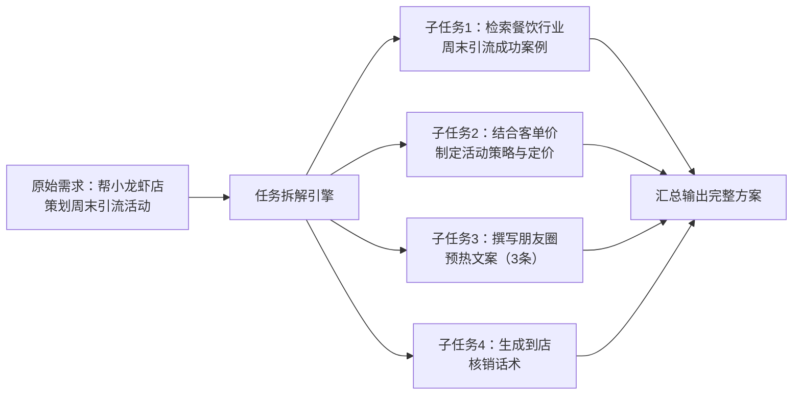
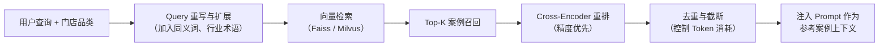

# S2 技术方案草图与关键流程说明

## 一、技术栈选型

| 技术层级 | 选型方案 | 选型理由 |
| :--- | :--- | :--- |
| **大语言模型** | DeepSeek（V3/V3.5） | 中文指令遵循能力突出，32K/128K 长上下文窗口适配门店历史记忆读取 |
| **Agent 调度器** | 自研轻量级任务调度器（Python） | 基于 ReAct 范式实现意图识别→任务拆解→工具调用→结果组装的完整决策环 |
| **知识库检索** | RAG 向量检索（Faiss / Milvus） | 存储有赞运营 SOP 与各行业实体店案例，支持语义级相似度匹配 |
| **对话记忆** | 本地 SQLite + 向量摘要（Long-term Memory） | 短期记忆存对话上下文，长期记忆按月维度摘要压缩，控制 Context Window 消耗 |
| **交互层** | Streamlit（前端快速原型） | 快速构建对话式 UI，支持多轮对话展示与自测验证 |
| **方言处理** | ASR 语音转文本 + Prompt 方言特征词库 | 前置正则匹配川渝方言关键词，兜底交由大模型语义理解 |

## 二、系统整体架构

系统采用经典的 **感知→决策→知识→执行** 四层架构，模块间通过结构化消息总线通信，确保解耦与可扩展性。

```mermaid
flowchart TD
    subgraph 感知层
        A["商家用户输入<br/>普通话 / 川渝方言"] --> B["意图识别与槽位提取<br/>（Intent Classification + Slot Filling）"]
    end

    subgraph 决策层
        B --> C{意图路由}
        C -->|"简单需求"<br/>（如：写一条朋友圈）" --> E["Prompt 组装模块"]
        C -->|"复杂需求"<br/>（如：策划周末引流活动）" --> D["任务拆解模块<br/>（Plan-and-Solve）"]
        C -->|"需要案例支撑"<br/>（如：同行怎么做）" --> F["RAG 知识库检索"]
        D --> E
        F --> E
    end

    subgraph 知识层
        F -->|"向量相似度检索"<br/>Top-K 案例召回" --> F
        F -->|"重排与去重"<br/>（Cross-Encoder Rerank）" --> F
    end

    subgraph 执行层
        E --> G["对话记忆模块<br/>读取门店画像 + 短期上下文"]
        G --> H["调用 DeepSeek 大模型推理<br/>（结构化 Prompt + 约束输出）"]
        H --> I["输出：营销方案 / 朋友圈文案 / 跟进话术"]
        I --> J["更新本轮对话记录<br/>存入短期记忆 + 月度摘要"]
    end

    style A fill:#4E79A7,stroke:#1C3A5E,color:#fff
    style B fill:#59A14F,stroke:#2A6B5A,color:#fff
    style C fill:#F28E2B,stroke:#B07AA1,color:#fff
    style D fill:#E15759,stroke:#6B2A35,color:#fff
    style E fill:#76B7B2,stroke:#2A5A6B,color:#fff
    style F fill:#EDC948,stroke:#4A3820,color:#000
    style G fill:#B07AA1,stroke:#5A2A6B,color:#fff
    style H fill:#9C755F,stroke:#4A3820,color:#fff
    style I fill:#4E79A7,stroke:#1C3A5E,color:#fff
    style J fill:#59A14F,stroke:#2A6B5A,color:#fff
```

## 三、关键流程详细说明

### 3.1 意图识别与槽位提取

商家输入自然语言后，首先经过意图分类模块，将需求归入以下预设意图类别：

| 意图类型 | 示例输入 | 提取槽位 |
| :--- | :--- | :--- |
| **活动策划** | "帮我想个周末引流活动" | `shop_type`（门店品类）、`activity_type`（活动类型）、`time_range`（时间范围） |
| **文案生成** | "写3条新品朋友圈" | `content_type`（朋友圈/话术/海报）、`quantity`（数量）、`tone`（语气风格） |
| **案例查询** | "同行怎么做私域" | `industry`（行业）、`keyword`（检索关键词） |
| **策略咨询** | "老客户怎么激活" | `strategy_type`（复购/拉新/留存）、`target_group`（目标客群） |

对于模糊或缺失槽位的输入，系统会自动发起追问（如："请问您的门店是什么品类呢？"），而非直接生成泛化内容。

### 3.2 方言识别方案

针对川渝等方言场景，采用 **双层识别策略**：

1. **第一层：关键词正则匹配**
   - 构建川渝方言特征词库（如"搞哈""整一个""巴适""雄起"等），通过正则表达式快速标记方言输入。
   - 匹配到方言特征后，在 System Prompt 中注入方言适配指令，引导大模型使用更接地气的表达方式。

2. **第二层：大模型语义理解兜底**
   - 即使未命中方言关键词，DeepSeek 的中文语义理解能力也能覆盖口语化表达。
   - 对于极端方言场景，后续可接入 ASR（语音识别）模块，将语音转为文本后再进入意图识别链路。

### 3.3 任务拆解（Plan-and-Solve）

复杂需求（如"帮小龙虾店策划周末引流活动"）按以下流程拆解：



拆解后的子任务以结构化 JSON 数组形式组织，每个子任务包含：
- `task_id`：子任务唯一标识
- `task_type`：任务类型（检索/生成/审核）
- `description`：任务描述
- `dependencies`：依赖的前置任务 ID
- `output_format`：期望的输出格式约束

### 3.4 RAG 知识库检索流程



**检索优化策略：**
- **Query 重写**：将口语化查询扩展为包含行业术语的标准查询（如"搞活动"→"促销活动/引流方案/会员运营"）。
- **两级检索**：先用向量检索快速召回 Top-20，再用 Cross-Encoder 精排取 Top-5，兼顾召回率与响应速度。
- **来源溯源**：每条检索结果附带 `source` 字段（如"有赞-餐饮行业-2024-Q2"），便于后续审计与优化。

### 3.5 Prompt 工程策略

Prompt 采用 **模板化 + 动态注入** 的设计：

```
System Prompt（固定）：
  你是资深私域运营顾问，服务实体店商家。
  请基于以下门店信息和参考案例，生成可落地的运营方案。

User Prompt（动态组装）：
  【门店信息】
  - 品类：{shop_type}
  - 客单价：{customer_price}
  - 历史活动：{history_activities}

  【用户指令】{user_query}

  【参考案例】
  {rag_results}

  【输出要求】
  - 风格：接地气，适合朋友圈转发
  - 格式：分步骤、带标题、可直接复制使用
  - 字数：每条文案 100-200 字
```

**防幻觉约束：**
- 在 Prompt 末尾追加："如果参考案例中没有相关信息，请明确告知商家'暂未找到匹配案例'，不要编造内容。"
- 设置 `temperature=0.3`，降低生成随机性，确保输出稳定性。

## 四、异常处理与降级策略

| 异常场景 | 降级策略 |
| :--- | :--- |
| **RAG 检索无结果** | 降级为纯大模型生成，并在输出中标注"本方案基于通用经验，未匹配到行业案例" |
| **DeepSeek API 超时/失败** | 重试 2 次（指数退避），仍失败则返回预设兜底话术："当前服务繁忙，请稍后再试" |
| **意图识别置信度低** | 触发澄清追问，而非盲目生成："您是想策划活动还是写文案呢？" |
| **方言无法识别** | 交由大模型语义兜底，并在日志中标记"方言待优化"，用于后续词库迭代 |
| **输出内容违规** | 内置敏感词过滤器，拦截违反《广告法》的极限词（如"最""第一"），替换为合规表述 |

## 五、性能指标基线

| 指标 | 目标值 | 说明 |
| :--- | :--- | :--- |
| **意图识别准确率** | > 90% | 覆盖 5 类核心意图 + 方言口语场景 |
| **RAG 检索 Top-5 命中率** | > 85% | 返回案例与当前门店品类/需求相关 |
| **简单指令响应时间** | < 2 秒 | 不含 RAG 检索的直接生成场景 |
| **复杂任务响应时间** | < 8 秒 | 含任务拆解 + RAG 检索 + 多步生成 |
| **方言识别覆盖率** | > 80% | 川渝方言常见表达可正确理解 |
